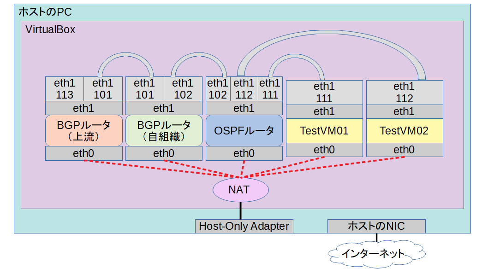

# E-S-DynamicRoutingPlayground
VagrantとAnsibleとquaggaを使用するルーティングプロトコル学習環境構築キット

## これは何？
E-S-DynamicRoutingPlaygroundは、動的ルーティングプロトコルを有効化したルータで構成されるネットワーク環境を構築するための、VagrantおよびAnsibleの設定ファイル群です。
ルーティングプロトコルの学習環境を簡単に構築できるようにすることを目的としています。
ルーティングソフトフェアにはquaggaを使用します。

## ネットワーク構成例
本リポジトリのデフォルトの設定でプロビジョニングした場合、下記のようなネットワーク環境が構築されます。




プロビジョニング中、図2の各VMは、ホストのPCのHost-Only Adapter経由でインターネットから必要なパッケージを落としてきます。
プロビジョニング後、図1のtestvm01, 02から外部組織の管理下にある想定のIPアドレス（デフォルトの設定では172.17.0.1です）に通信できるようになっているはずです。

```
$ ping -c 1 172.17.0.1
PING 172.17.0.1 (172.17.0.1) 56(84) bytes of data.
64 bytes from 172.17.0.1: icmp_seq=1 ttl=62 time=0.606 ms

--- 172.17.0.1 ping statistics ---
1 packets transmitted, 1 received, 0% packet loss, time 0ms
rtt min/avg/max/mdev = 0.606/0.606/0.606/0.000 ms

$ tracepath 172.17.0.1 -n
 1?: [LOCALHOST]                                         pmtu 1500
 1:  172.16.1.254                                          0.258ms
 1:  172.16.1.254                                          0.192ms
 2:  172.16.255.1                                          0.338ms
 3:  172.17.0.1                                            0.483ms reached
     Resume: pmtu 1500 hops 3 back 3
```

この時の経路は下記の通りです。

### OSPFルータ
```
$ ip r
default via 172.16.255.1 dev eth1.102 proto zebra metric 1
10.0.2.0/24 dev eth0 proto kernel scope link src 10.0.2.15 metric 100
172.16.0.1 via 172.16.255.1 dev eth1.102 proto zebra metric 20
172.16.1.0/24 dev eth1.111 proto kernel scope link src 172.16.1.254
172.16.2.0/24 dev eth1.112 proto kernel scope link src 172.16.2.254
172.16.255.0/24 dev eth1.102 proto kernel scope link src 172.16.255.2
```

### BGPルータ（自組織）
```
$ ip r
10.0.2.0/24 dev eth0 proto kernel scope link src 10.0.2.15 metric 100
172.16.0.2 via 172.16.255.2 dev eth1.102 proto zebra metric 20
172.16.1.0/24 via 172.16.255.2 dev eth1.102 proto zebra metric 20
172.16.2.0/24 via 172.16.255.2 dev eth1.102 proto zebra metric 20
172.16.255.0/24 dev eth1.102 proto kernel scope link src 172.16.255.1
172.17.0.0/16 via 192.168.100.2 dev eth1.101 proto zebra
192.168.100.0/24 dev eth1.101 proto kernel scope link src 192.168.100.1
```

### BGPルータ（上流）
```
$ ip r
10.0.2.0/24 dev eth0 proto kernel scope link src 10.0.2.15 metric 100
172.16.0.0/16 via 192.168.100.1 dev eth1.101 proto zebra
172.17.0.0/24 dev eth1.113 proto kernel scope link src 172.17.0.1
192.168.100.0/24 dev eth1.101 proto kernel scope link src 192.168.100.2
```

また、各VM上のospfdおよびbgpdのコンソールへはtelnetで接続できます。
デフォルトの設定でのパスワードは`password`です。
詳しくはquaggaのドキュメントをご参照ください。

## 必要なもの
### ソフトウェア
- Vagrant
- VirtualBox
- VirtualBoxが動かせるOS
- git

### ハードウェア
- メモリ512MBのVMが5台作れるくらいのスペックのPC

本リポジトリの作成にあたっては下記の環境で動作を確認しています。

### ソフトウェア
- Vagrantのバージョン：2.2.9
- VirtualBoxのバージョン：6.0.22
- gitのバージョン：2.25.1

### ハードウェア
- OS名：Microsoft Windows 10 Home
- プロセッサ：Intel Core i7-7700
- メモリ：16GB

## セットアップ手順
本手順ではUnix系OSにおけるコマンドラインシェル上での操作を前提とします。
Windows 10をお使いの方は、WSLを有効化しUbuntuなどのディストリビューションを入れ、そこから操作する事で同様の手順でのセットアップが可能です。
またVagrantおよびVirtualBoxがインストールされていることを前提とします。

まず、本リポジトリの内容をGitHubからダウンロードし、E-S-DynamicRoutingPlaygroundのディレクトリに移動します。

```
$ cd ~/
$ git clone https://github.com/Sybil-E/E-S-DynamicRoutingPlayground.git
$ cd E-S-DynamicRoutingPlayground/
```

`vagrant status`で、作成するVMのリストを確認します。
下記のようなリストが表示されるはずです。

```
$ vagrant status
Current machine states:

isp-bgprt01               not created (virtualbox)
own-bgprt01               not created (virtualbox)
igp-rt01                  not created (virtualbox)
testvm01                  not created (virtualbox)
testvm02                  not created (virtualbox)

This environment represents multiple VMs. The VMs are all listed
above with their current state. For more information about a specific
VM, run `vagrant status NAME`.
```

次に`vagrant up --provision`で、VMの作成とプロビジョニングを実行します。
回線速度にもよりますが、十数分程度はかかります。

```
$ vagrant up --provision
Bringing machine 'isp-bgprt01' up with 'virtualbox' provider...
Bringing machine 'own-bgprt01' up with 'virtualbox' provider...
Bringing machine 'igp-rt01' up with 'virtualbox' provider...
Bringing machine 'testvm01' up with 'virtualbox' provider...
Bringing machine 'testvm02' up with 'virtualbox' provider...
==> isp-bgprt01: Box 'centos/7' could not be found. Attempting to find and install...
    isp-bgprt01: Box Provider: virtualbox
    isp-bgprt01: Box Version: >= 0
==> isp-bgprt01: Loading metadata for box 'centos/7'
・
・
・
省略
・
・
・
TASK [user_vm : dhcp ip provided] **********************************************
changed: [target]

PLAY RECAP *********************************************************************
target                     : ok=7    changed=3    unreachable=0    failed=0    skipped=0    rescued=0    ignored=2

==> testvm02: Running provisioner: shell...
    testvm02: Running: inline script
```

vagrant ssh （VM名）で各VMにログインできますので、あとはご自由にどうぞ。

## 設定変更について
パラメータやAnsibleのプレイブックを変更後に、その変更を適用するためには、`vagrant reload --provision`を実行します。
本リポジトリで提供するVagrantfileにおいては、プロビジョニングの最後のステップにおいて、Vagrantが自動で設定するデフォルトゲートウェイの情報を消すような処理を実行させます。
そのため、`vagrant provision`を実行してVMを起動させたままプロビジョニングしようとしても、インターネットに接続できず失敗します。

もしインターネットへの接続を要しない設定変更（VLANのパラメータの変更など）を、何らかの理由でVMを再起動させずに実施したい場合は、`vagrant provision --provision-with ansible_local`と実行してください。

## パラメータについて
本リポジトリで提供するAnsibleのプレイブックにおいては、各種パラメータは`playbook/group_vars/local.yml`のファイルに集約されています。
試してみたいことに応じて色々変更してみてください。
